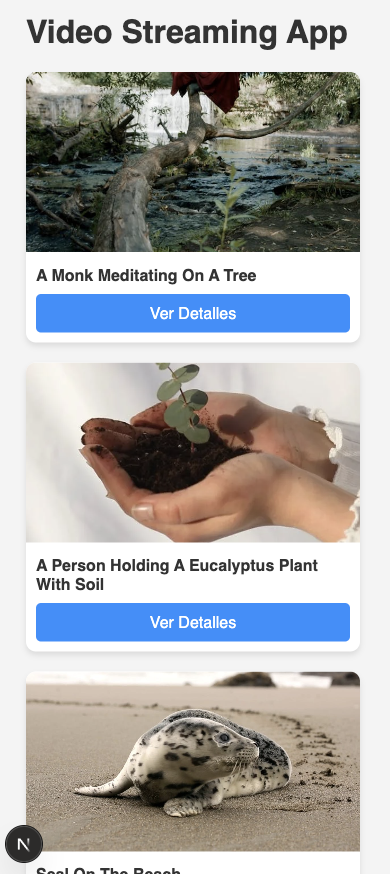
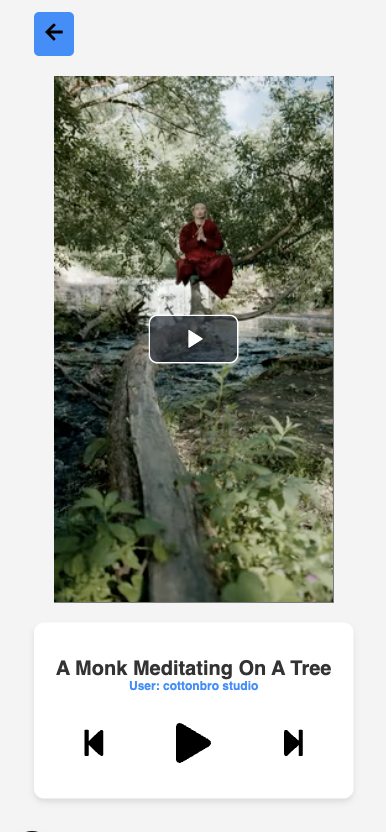

# 🎮 Video Streaming App

A simple yet powerful **video streaming application** built with **Next.js, React, and Video.js**. This project allows users to browse and watch videos, featuring **playback controls, user information, and responsive design**.

---

## 🚀 **Features**

✅ **Next.js** - Server-side rendering for fast performance.  
✅ **Video.js** - Advanced video player with custom controls.  
✅ **Custom Hooks** - Modular structure with `useVideo` and `useVideoPlayer`.  
✅ **Dynamic Routing** - Each video has its unique page (`/video/[id]`).  
✅ **Styled with SCSS** - Clean and responsive UI.  
✅ **Modular Components** - Easy to maintain and scale.

---

## 🛠 **Installation & Setup**

### **1️⃣ Clone the Repository**

```bash
git clone https://github.com/YOUR_GITHUB_USERNAME/YOUR_REPO_NAME.git
cd YOUR_REPO_NAME
```

### **2️⃣ Install Dependencies**

```bash
npm install
```

### **3️⃣ Set Up Environment Variables**

Create a `.env.local` file in the root directory and add:

```bash
PEXELS_API_KEY=your-api-key-here
```

### **4️⃣ Run the Development Server**

```bash
npm run dev
```

📚 The app will be available at **`http://localhost:3000`**.

---

## 🎨 **Tech Stack**

🔹 **Frontend:** Next.js, React, TypeScript  
🔹 **Styling:** SCSS (Modules)  
🔹 **Video Player:** Video.js  
🔹 **Icons:** React Icons  
🔹 **API:** Pexels Video API

---

## 🌏 **Screenshots**

### **Home Page (Video List)**



### **Video Player Page**

## 

## 📌 **Usage Guide**

1. **Browse videos** from the list.
2. **Click on a video** to navigate to its player page.
3. **Control playback** using play, pause, rewind, and fast-forward buttons.
4. **View video details**, including user information and video title.
5. **Return to the video list** using the back button.

---

## 🤝 **Contributing**

Contributions are welcome! Feel free to:

- Open an **issue** for bug reports or feature requests.
- Submit a **pull request** to improve the project.

---

## 📝 **License**

This project is **open-source** under the **MIT License**.

---

🚀 **Happy Coding!** 🎮🔥
